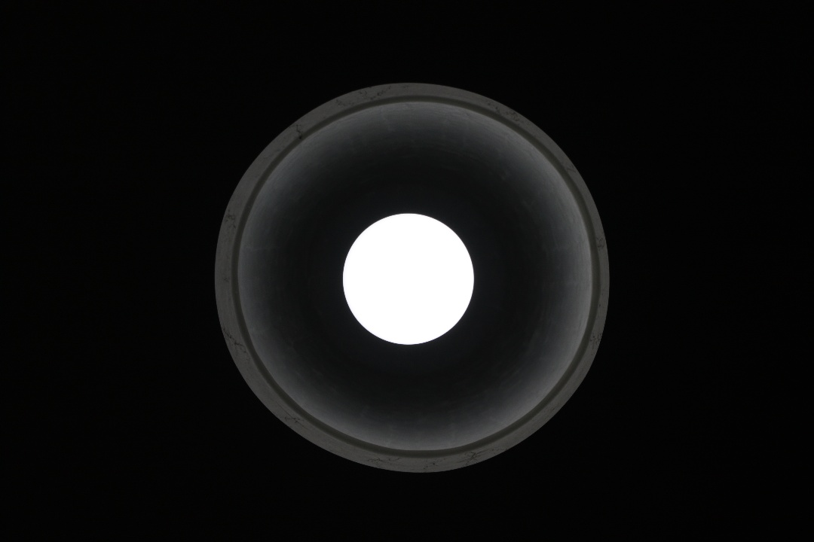
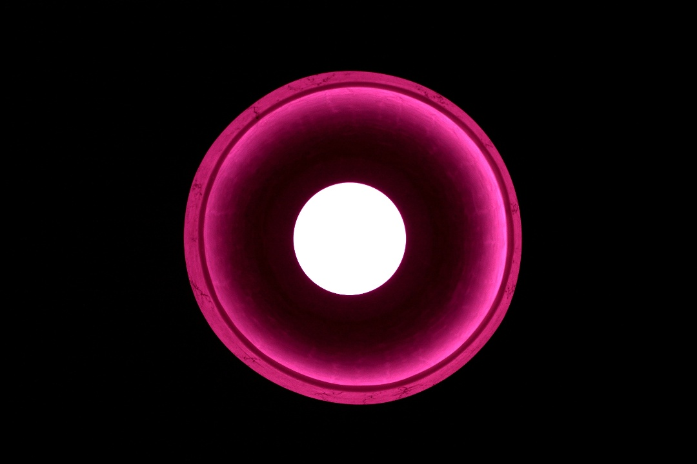
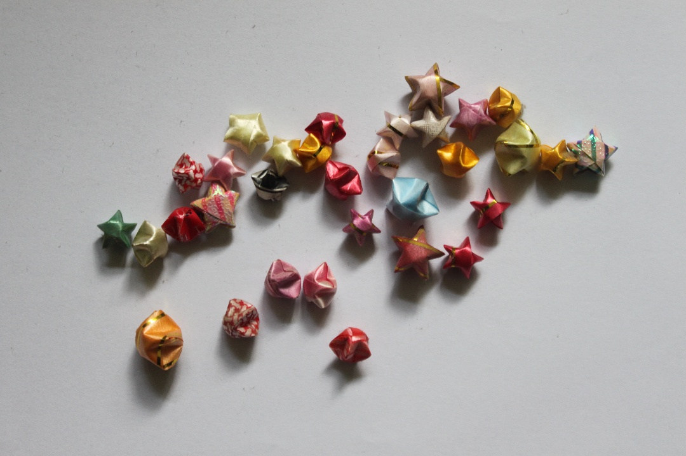
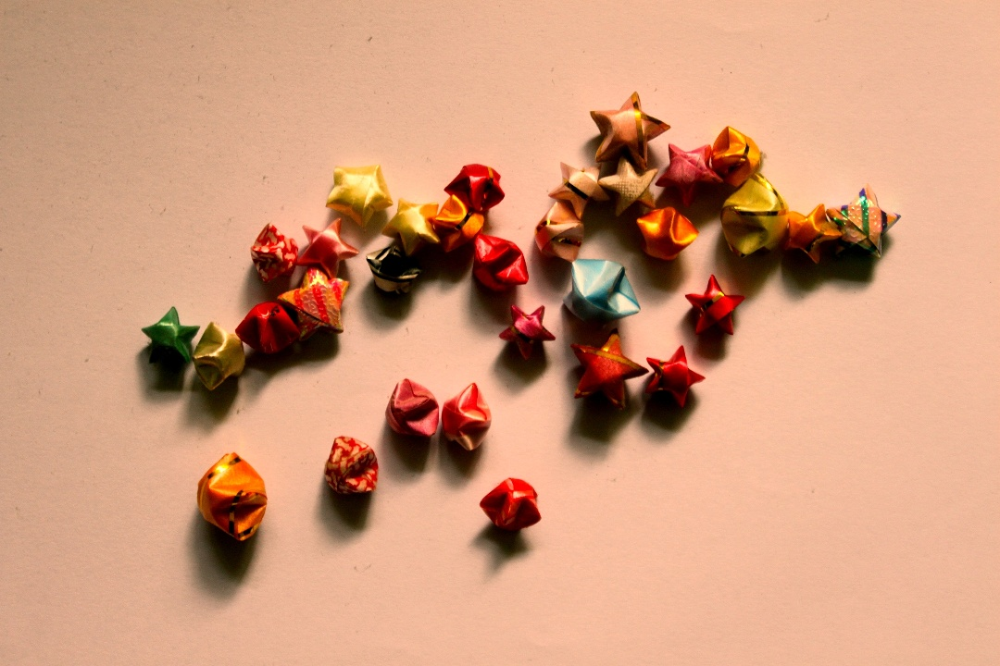
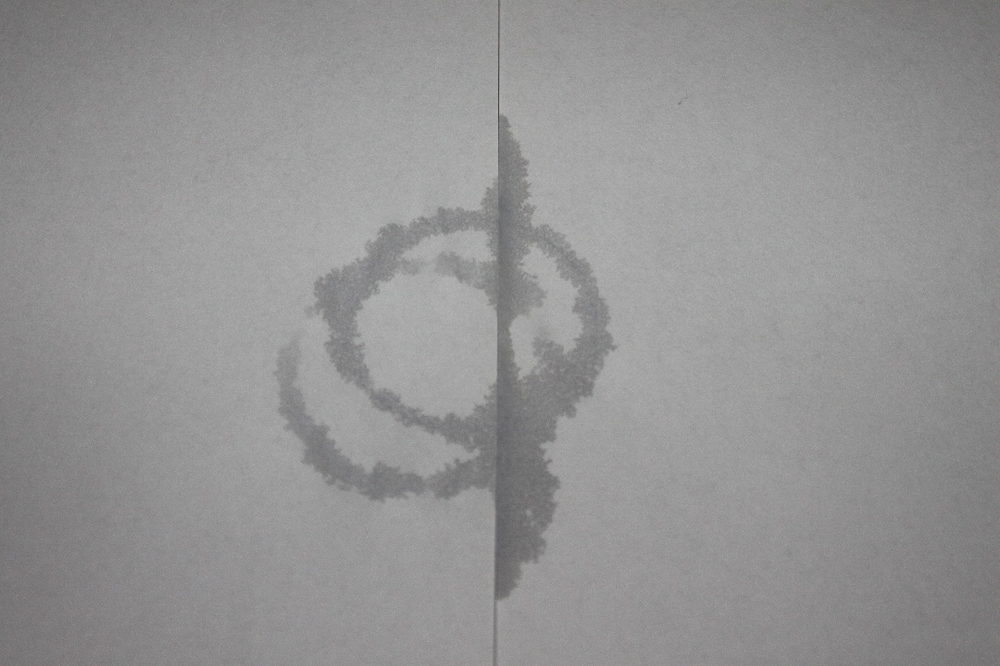
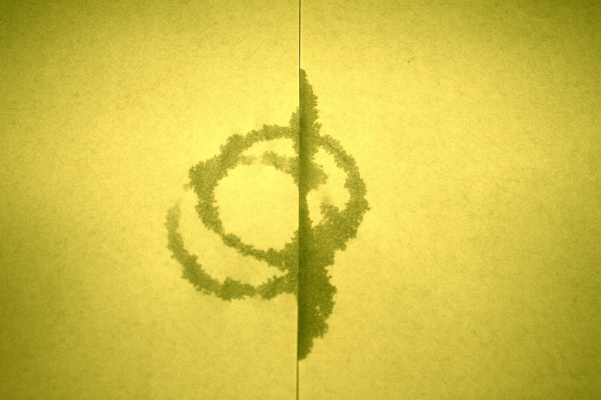

# Aesthetic Net

Image Pose-procressing through Optimizaion

## Demo

Try our [online demo](http://zyayoung.gitee.io/blog/passages/ANetDemo/). Here are some results:

| Original Image | Optimized Image |
|-|-|
|||
|||
|||

## Run

First prepare a trained model. Then run

```bash
python optimize.py im2optimize.jpg out.jpg
```

## Train

### Prepare Ava Dataset

Download Ava Dataset
```
ava
 |-AVA.txt
 |-images
    |- xxxxx.jpg
```

- “AVA: A Large-Scale Database for Aesthetic Visual Analysis”. Naila Murray, Luca Marchesotti, Florent Perronnin, CVPR 2012.

### Prerequest

Install pytorch and torchvision

### Select Model and Train

Mnasnet 1.0 is used by default, edit train.py to change model.

```bash
python train.py --save-model
```
